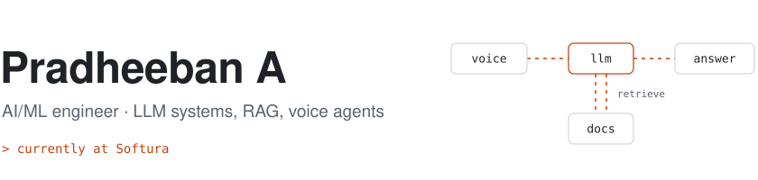

<picture>
  <source media="(prefers-color-scheme: dark)" srcset="assets/header-dark.svg">
  
</picture>

I work on applied AI: LLM applications backed by retrieval, multi-agent systems, voice interfaces, and the React front ends that make them usable. I'm currently at **Softura**. Before that I spent eight months on a network security product at Telesoft Technologies. I studied Computer Science (AI & ML) at Sri Eshwar College of Engineering and have published two papers on conversational and agentic AI.

Right now I'm focused on what it takes to move LLM and RAG systems from a demo to production: deploying models on Azure, and trying React Native for AI-backed mobile apps.

## Work

**Softura** · *current*

**Telesoft Technologies (UK)** · Engineering Trainee · *Jun 2025 – Jan 2026*\
Worked on IntSOC, an AI-powered network detection and response (NDR) platform for real-time security monitoring. I built frontend features in React and TypeScript, wrote the Node.js and REST integrations behind its live monitoring views, and worked through stability and performance issues with the engineering team in the UK.

## Projects

**PrepWise** · *2026*\
Interview preparation run by a multi-agent LLM system. It reviews a candidate's resume, matches it against job roles, and runs voice-based mock interviews that finish with personalised coaching. The design is published in IRJAEH (below). Built with agentic AI, LLMs, NLP and React.

**ASTRA** · *2025*\
A voice assistant that helps people find their way around and get information by just asking. Each question goes through a RAG pipeline before the LLM answers, so replies are grounded in real information and come with a visual alongside the spoken response. Built with LLMs, RAG and generative AI.

**Anomaly detection for CCTV** · *2024*\
Flags events like shoplifting and assault in surveillance footage. A CNN reads each frame and an LSTM tracks how those features change over time, so the model reacts to what is happening rather than to a single still. Trained on the UCF-Crime dataset, with a Streamlit front end. Built in Python.

## Papers

- **Multi-Agent Personalized Interview Coach: An AI-Powered Platform for Career Readiness**\
  IRJAEH, 2025 · [doi:10.47392/IRJAEH.2025.0575](https://doi.org/10.47392/IRJAEH.2025.0575)
- **Marching Forward: Redefining Human–Machine Interactions in Conversational AI Through Hybrid Intelligence, Blockchain Security, and Autonomous Agents**\
  IEEE ICCES, 2024 · [doi:10.1109/ICCES63552.2024.10859659](https://doi.org/10.1109/ICCES63552.2024.10859659)

## Toolbox

**AI / ML:** LLMs, RAG, LangChain, embeddings, agent systems, prompt engineering, Transformers, PyTorch, TensorFlow, scikit-learn, Hugging Face\
**Web:** React, TypeScript, Node.js, Express, REST APIs, Flask, HTML/CSS\
**Languages:** Python, TypeScript, C, C++, Java, SQL\
**Data & tools:** MongoDB, Git, Colab, Figma

## Elsewhere

- 1st place, Ideathon, Karpagam College · 2nd place, Hackathon, Sengunthar College of Engineering · 2nd place, Project Expo, Karpagam College (all 2024)
- Selected as one of 30 official content creators for KGeN.io out of 250+ applicants
- Passed the Japanese Language Proficiency Test (JLPT) at level N5

Certifications

- Supervised Machine Learning, DeepLearning.AI & Stanford University (2024)
- Mastering DSA using C and C++, Udemy (2024)
- HackerRank: Python, SQL (2024)
- Crash Course on Python, Coursera (2023)

---

[pradheebananand@gmail.com](mailto:pradheebananand@gmail.com) · [LinkedIn](https://www.linkedin.com/in/pradheeban/) · [LeetCode](https://leetcode.com/u/pradheeban15/) · [CodeChef](https://www.codechef.com/users/pradheeban15)

Open to AI/ML and generative AI roles. Happy to talk about RAG, agents, NLP or full-stack work.
